# 🤖 AI Analyst Team - Dokumentacja Techniczna

> **Wersja:** 1.0.0 Enterprise Edition  
> **Status:** Production-Ready PoC  

---

## 📋 Spis Treści

1. [Wprowadzenie](#wprowadzenie)
2. [Architektura Systemu](#architektura-systemu)
3. [Komponenty Kluczowe](#komponenty-kluczowe)
4. [Ekosystem Agentów](#ekosystem-agentów)
5. [Strategie Analizy](#strategie-analizy)
6. [Use Cases - Scenariusze Biznesowe](#use-cases)
7. [Innowacje i WOW Factors](#innowacje)
8. [Monitoring i Audyt](#monitoring)
9. [Roadmapa Rozwoju](#roadmapa)
10. [Stack Technologiczny](#stack)

---

## 🎯 Wprowadzenie

### Wizja Projektu

**AI Analyst Team** to wieloagentowy ekosystem zaprojektowany do automatyzacji procesów analizy systemowej i biznesowej. System nie jest prostym chatbotem, lecz inteligentną "sztafetą" wyspecjalizowanych agentów AI, którzy wspólnie rozwiązują złożone problemy inżynierskie – od weryfikacji wymagań biznesowych, przez audyt struktur bazodanowych (SQL), aż po inżynierię wsteczną modeli UML/BPMN.

### Problem Biznesowy

Tradycyjne podejście do dokumentacji systemowej boryka się z fundamentalnymi wyzwaniami:

- **Fragmentacja wiedzy** - informacje rozproszone w różnych systemach (EA, Confluence, SharePoint, SQL)
- **Brak synchronizacji** - dokumentacja biznesowa nie jest spójna z implementacją techniczną
- **Wysokie koszty** - drogie licencje narzędzi CASE i dedykowany czas analityków
- **Szybka deprecjacja** - dokumentacja staje się nieaktualna zanim zostanie ukończona

### Rozwiązanie

System implementuje **Multi-Agent Relay Pattern** - inteligentną sztafetę wyspecjalizowanych agentów, gdzie każdy buduje na dedykowanych plikach lub/i na wynikach poprzedniego, a centralny Orkiestrator zapewnia spójność i jakość.

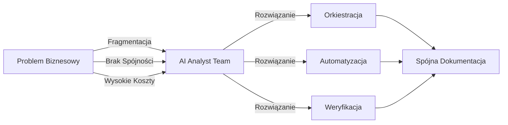
```mermaid
graph LR
    A[Problem Biznesowy] -->|Fragmentacja| B[AI Analyst Team]
    A -->|Brak Spójności| B
    A -->|Wysokie Koszty| B
    
    B -->|Rozwiązanie| C[Orkiestracja]
    B -->|Rozwiązanie| D[Automatyzacja]
    B -->|Rozwiązanie| E[Weryfikacja]
    
    C --> F[Spójna Dokumentacja]
    D --> F
    E --> F
    
```

---

## 🏗️ Architektura Systemu

### Architektura Wysokiego Poziomu

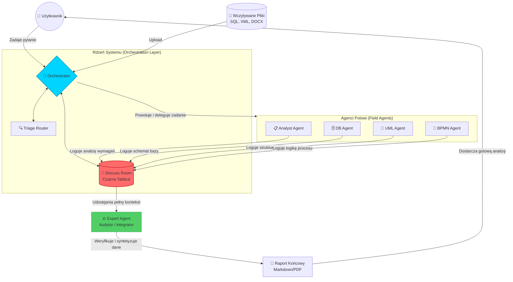
```mermaid
graph TD
    %% Warstwa Wejściowa
    User((👤 Użytkownik)) -- "Zadaje pytanie" --> Orchestrator
    Files[(📁 Wczytywane Pliki<br/>SQL, XML, DOCX)] -- "Upload" --> Orchestrator

    %% Rdzeń Systemu
    subgraph Core ["Rdzeń Systemu (Orchestration Layer)"]
        Orchestrator{🧠 Orchestrator}
        DiscussRoom[(💬 Discuss Room<br/>'Czarna Tablica')]
        Triage[🔍 Triage Router]
    end

    Orchestrator <--> Triage
    Orchestrator <--> DiscussRoom

    %% Warstwa Agentów
    subgraph Agents ["Agenci Polowi (Field Agents)"]
        AA[📋 Analyst Agent]
        DA[🗄️ DB Agent]
        UA[📐 UML Agent]
        BA[🔄 BPMN Agent]
    end

    %% Warstwa Ekspercka i Wyjściowa
    Expert[⚖️ Expert Agent<br/>Audytor i Integrator]
    Report[📄 Raport Końcowy<br/>Markdown/PDF]

    %% Przepływ Procesu
    Orchestrator -- "Powołuje i deleguje zadania" --> Agents
    
    AA -- "Loguje analizę wymagań" --> DiscussRoom
    DA -- "Loguje schemat bazy" --> DiscussRoom
    UA -- "Loguje strukturę klas" --> DiscussRoom
    BA -- "Loguje logikę procesu" --> DiscussRoom

    DiscussRoom -- "Udostępnia pełny kontekst" --> Expert
    Expert -- "Weryfikuje i syntetyzuje dane" --> Report
    Report -- "Dostarcza gotową analizę" --> User

    %% Style
    style Orchestrator fill:#00d4ff,stroke:#0099cc,stroke-width:2px
    style DiscussRoom fill:#ff6b6b,stroke:#c92a2a,stroke-width:2px
    style Expert fill:#51cf66,stroke:#2f9e44
```

### Przepływ Danych - Request Lifecycle

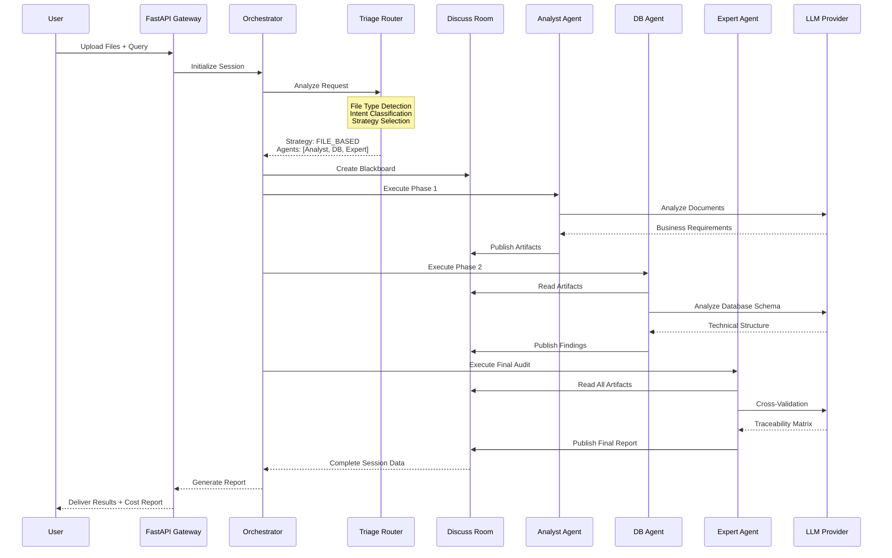
```mermaid
sequenceDiagram
    participant U as User
    participant API as FastAPI Gateway
    participant O as Orchestrator
    participant T as Triage Router
    participant R as Discuss Room
    participant A1 as Analyst Agent
    participant A2 as DB Agent
    participant E as Expert Agent
    participant LLM as LLM Provider
    
    U->>API: Upload Files + Query
    API->>O: Initialize Session
    O->>T: Analyze Request
    
    Note over T: File Type Detection<br/>Intent Classification<br/>Strategy Selection
    
    T-->>O: Strategy: FILE_BASED<br/>Agents: [Analyst, DB, Expert]
    
    O->>R: Create Blackboard
    
    O->>A1: Execute Phase 1
    A1->>LLM: Analyze Documents
    LLM-->>A1: Business Requirements
    A1->>R: Publish Artifacts
    
    O->>A2: Execute Phase 2
    A2->>R: Read Artifacts
    A2->>LLM: Analyze Database Schema
    LLM-->>A2: Technical Structure
    A2->>R: Publish Findings
    
    O->>E: Execute Final Audit
    E->>R: Read All Artifacts
    E->>LLM: Cross-Validation
    LLM-->>E: Traceability Matrix
    E->>R: Publish Final Report
    
    R-->>O: Complete Session Data
    O-->>API: Generate Report
    API-->>U: Deliver Results + Cost Report
```

---

## 🔑 Komponenty Kluczowe

### 1. Orchestrator Engine - "Mózg Systemu"

**Orchestrator** to centralny komponent zarządzający całym cyklem życia analizy. Jego architektura opiera się na trzech filarach:

#### Faza 1: Triage & Context Analysis

**Kluczowe możliwości:**
- Detekcja dialektów SQL (PostgreSQL, MySQL, Oracle, MSSQL)
- Rozpoznawanie standardów UML (XMI 2.1, 2.5, EA proprietary)
- Identyfikacja formatów BPMN (2.0, Camunda, jBPM)
- Klasyfikacja dokumentów biznesowych (requirements, specifications, stories)

#### Faza 2: Selective Agent Activation

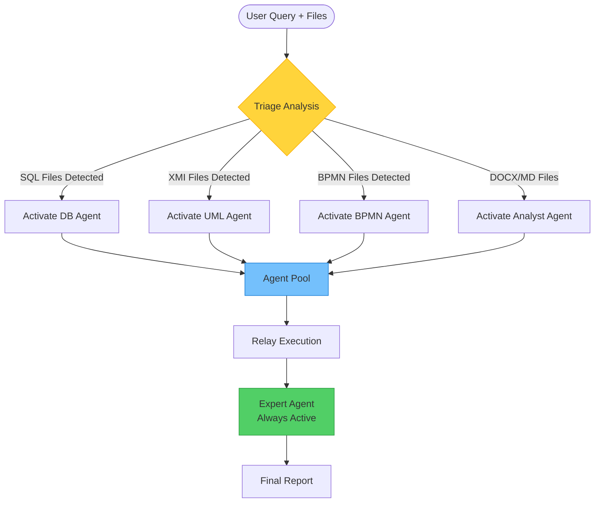
```mermaid
graph TD
    START([User Query + Files]) --> TRIAGE{Triage Analysis}
    
    TRIAGE -->|SQL Files Detected| ACTIVATE_DB[Activate DB Agent]
    TRIAGE -->|XMI Files Detected| ACTIVATE_UML[Activate UML Agent]
    TRIAGE -->|BPMN Files Detected| ACTIVATE_BPMN[Activate BPMN Agent]
    TRIAGE -->|DOCX/MD Files| ACTIVATE_ANALYST[Activate Analyst Agent]
    
    ACTIVATE_DB --> POOL[Agent Pool]
    ACTIVATE_UML --> POOL
    ACTIVATE_BPMN --> POOL
    ACTIVATE_ANALYST --> POOL
    
    POOL --> RELAY[Relay Execution]
    RELAY --> EXPERT[Expert Agent<br/>Always Active]
    
    EXPERT --> REPORT[Final Report]
    
    style TRIAGE fill:#ffd43b,stroke:#fab005
    style POOL fill:#74c0fc,stroke:#1c7ed6
    style EXPERT fill:#51cf66,stroke:#2f9e44
```

**Optymalizacje:**
- **Context Truncation** - tylko istotne fragmenty plików trafiają do LLM
- **Lazy Loading** - agenci aktywowani on-demand
- **Token Budgeting** - dynamiczny limit per agent

#### Faza 3: Relay Management

Orkiestrator pilnuje sekwencji wykonania:

1. **Analyst Agent** → Ekstrakcja wymagań biznesowych
2. **Domain Agents** (DB/UML/BPMN) → Analiza techniczna równoległa
3. **Expert Agent** → Synteza, weryfikacja, audyt

### 2. Discuss Room - Blackboard Architecture

**Discuss Room** implementuje wzorzec Blackboard - wspólną przestrzeń wymiany wiedzy między agentami.


```mermaid
graph TB
    subgraph DiscussRoom["Discuss Room (Blackboard)"]
        subgraph InternalThoughts["Internal Thoughts Layer"]
            IT1[Analyst: Chain-of-Thought]
            IT2[DB: Technical Analysis]
            IT3[UML: Structure Mapping]
        end
        
        subgraph Artifacts["Artifacts Repository"]
            ART1[Business Requirements JSON]
            ART2[Database Schema Model]
            ART3[UML Class Diagram Code]
            ART4[BPMN Process Map]
        end
        
        subgraph PublicMessages["Public Communication"]
            MSG1[Progress Updates]
            MSG2[Cross-Agent Questions]
            MSG3[Validation Results]
        end
    end
    
    AA[Analyst Agent] -->|Writes| IT1
    AA -->|Publishes| ART1
    
    DA[DB Agent] -->|Reads| ART1
    DA -->|Writes| IT2
    DA -->|Publishes| ART2
    
    UA[UML Agent] -->|Writes| IT3
    UA -->|Publishes| ART3
    
    EA[Expert Agent] -->|Reads All| InternalThoughts
    EA -->|Reads All| Artifacts
    EA -->|Synthesizes| MSG3
    
    style DiscussRoom fill:#e8e8e8,stroke:#999,stroke-width:2px
    style InternalThoughts fill:#fff3bf,stroke:#fcc419
    style Artifacts fill:#d0ebff,stroke:#1c7ed6
    style PublicMessages fill:#d3f9d8,stroke:#37b24d
```


### 3. BaseAgent - Fundament Architektoniczny

Wszyscy agenci dziedziczą po abstrakcyjnej klasie `BaseAgent`:

**Zalety architektoniczne:**
- **Separation of Concerns** - logika vs instrukcje
- **Hot-Reload** - zmiana zachowania bez restart
- **Audit Trail** - każda akcja logowana
- **Cost Attribution** - precyzyjna alokacja kosztów

---

## 👥 Ekosystem Agentów

### Agent Matrix - Podział Odpowiedzialności

| Agent | Domena | Input Files | Core Capabilities | Output Artifacts |
|-------|--------|-------------|-------------------|------------------|
| **Analyst Agent** | Business Logic | DOCX, PDF, MD | Requirements extraction, User Story generation | Requirements JSON, Traceability IDs |
| **DB Agent** | Data Architecture | SQL, DDL, DML | Schema analysis, Relation mapping, Performance hints | Schema Model, Data Dictionary |
| **UML Agent** | System Design | XML, XMI, EAP | Class extraction, Dependency analysis, Diagram generation | Mermaid/PlantUML code |
| **BPMN Agent** | Process Engineering | BPMN, XML | Workflow analysis, Gateway validation, Role mapping | Process Map, Bottleneck Report |
| **Expert Agent** | Quality Assurance | All artifacts | Cross-validation, Gap detection, Report synthesis | Traceability Matrix, Final Report |

### Szczegółowe Profile Agentów

#### 🔍 Analyst Agent - "Business Logic Expert"

**Misja:** Transformacja nieformalnych dokumentów biznesowych w strukturalne wymagania systemowe.

**Kluczowe techniki:**
- **Chain-of-Thought Reasoning** - wieloetapowa dekompozycja problemu
- **Entity Extraction** - identyfikacja obiektów biznesowych (User, Order, Payment)
- **Dependency Mapping** - wykrywanie zależności między wymaganiami

**Przykładowy Output:**

```json
{
  "requirements": [
    {
      "id": "REQ-001",
      "type": "functional",
      "priority": "high",
      "title": "Multi-currency Support",
      "description": "System must support transactions in EUR, USD, PLN",
      "business_entities": ["Transaction", "Currency", "ExchangeRate"],
      "acceptance_criteria": [
        "User can select currency during checkout",
        "Prices automatically converted based on current rates",
        "Historical exchange rates stored for audit"
      ]
    }
  ]
}
```

#### 🗄️ DB Agent - "Data Architecture Specialist"

**Misja:** Reverse engineering struktur bazodanowych i tłumaczenie na język biznesowy.

**Unikalne możliwości:**
- **Dialect Detection** - automatyczne rozpoznawanie dialektu SQL
- **Relation Inference** - wykrywanie relacji nawet bez zdefiniowanych FK
- **Business Naming** - mapowanie tabel na procesy (TRN_01 → "Payment Authorization")

**Przykład analizy:**

```sql
-- Input DDL
CREATE TABLE TRN_PAYMENT (
    TRN_ID INT PRIMARY KEY,
    USER_ID INT,
    AMOUNT DECIMAL(10,2),
    CURRENCY_CODE CHAR(3),
    STATUS VARCHAR(20)
);
```

**Agent Output:**
```markdown
### Business Process: Payment Transaction

**Table:** TRN_PAYMENT  
**Purpose:** Stores individual payment transactions

**Business Logic:**
- Each transaction linked to specific user (USER_ID)
- Supports multi-currency (CURRENCY_CODE: ISO 4217)
- Transaction lifecycle tracked via STATUS field

**Potential Issues:**
⚠️ Missing Foreign Key to CURRENCY reference table  
⚠️ No timestamp fields for audit trail  
💡 Recommendation: Add CREATED_AT, UPDATED_AT columns
```

#### 🎨 UML Agent - "Systems Architect"

**Misja:** Wizualizacja architektury systemowej poprzez automatyczne generowanie diagramów.

**Supported Standards:**
- XMI 2.1, 2.5 (Enterprise Architect, StarUML)
- PlantUML

**Przykład wyjścia:**

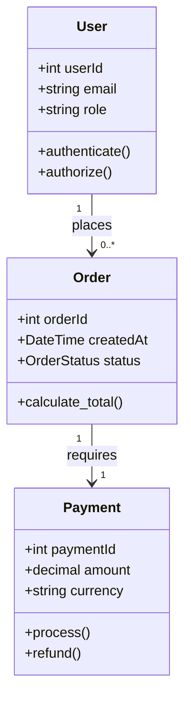
```mermaid
classDiagram
    class User {
        +int userId
        +string email
        +string role
        +authenticate()
        +authorize()
    }
    
    class Order {
        +int orderId
        +DateTime createdAt
        +OrderStatus status
        +calculate_total()
    }
    
    class Payment {
        +int paymentId
        +decimal amount
        +string currency
        +process()
        +refund()
    }
    
    User "1" --> "0..*" Order : places
    Order "1" --> "1" Payment : requires
```

#### 🔄 BPMN Agent - "Process Engineer"

**Misja:** Analiza logiki procesowej i wykrywanie wąskich gardeł.

**Kluczowe analizy:**
- **Gateway Validation** - sprawdzanie kompletności warunków decyzyjnych
- **Role Assignment** - identyfikacja uczestników procesu (Swimlanes)
- **Bottleneck Detection** - wykrywanie potencjalnych blokad

**Przykład raportu:**

```markdown
### Process: Order Fulfillment

**Participants:** Customer, Sales Rep, Warehouse, Finance

**Critical Path:** 
Order Received → Credit Check → Inventory Allocation → Shipping → Invoice

**Identified Issues:**

1. ⚠️ **Bottleneck at Credit Check**
   - No timeout defined
   - Can block entire process indefinitely
   - Recommendation: Add 24h SLA with escalation

2. ⚠️ **Missing Error Handler**
   - Gateway "Inventory Available?" has no ELSE branch
   - Recommendation: Add backorder subprocess

**Process Metrics:**
- Total Steps: 12
- Decision Points: 3
- Parallel Branches: 2
- Estimated Cycle Time: 2-5 days
```

#### ⚖️ Expert Agent - "Quality Guardian"

**Misja:** Finalny audyt, cross-validation i synteza wiedzy z wszystkich agentów.

**Unikalna rola:** Expert Agent NIE generuje nowej wiedzy domenowej, lecz weryfikuje spójność i buduje **Traceability Matrix**.

**Proces walidacji:**

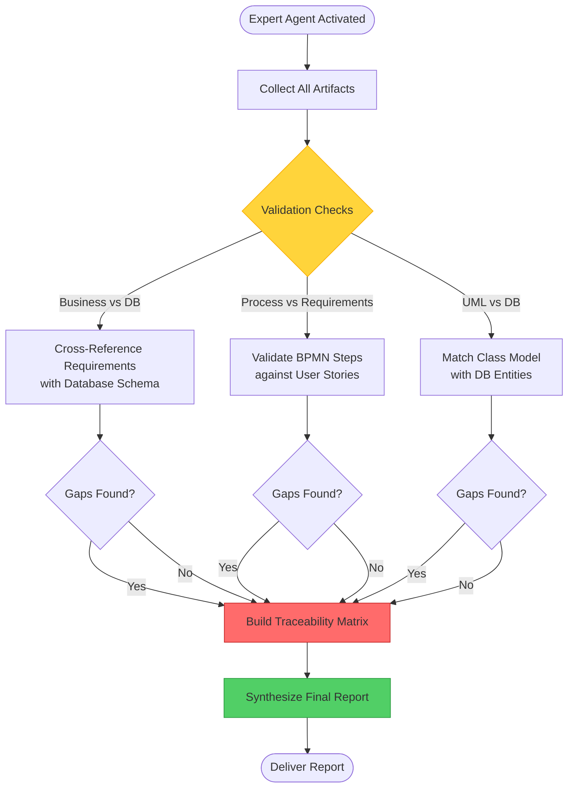
```mermaid
graph TD
    START([Expert Agent Activated]) --> COLLECT[Collect All Artifacts]
    
    COLLECT --> VALIDATE{Validation Checks}
    
    VALIDATE -->|Business vs DB| CHECK1[Cross-Reference Requirements<br/>with Database Schema]
    VALIDATE -->|Process vs Requirements| CHECK2[Validate BPMN Steps<br/>against User Stories]
    VALIDATE -->|UML vs DB| CHECK3[Match Class Model<br/>with DB Entities]
    
    CHECK1 --> GAP1{Gaps Found?}
    CHECK2 --> GAP2{Gaps Found?}
    CHECK3 --> GAP3{Gaps Found?}
    
    GAP1 -->|Yes| MATRIX[Build Traceability Matrix]
    GAP2 -->|Yes| MATRIX
    GAP3 -->|Yes| MATRIX
    
    GAP1 -->|No| MATRIX
    GAP2 -->|No| MATRIX
    GAP3 -->|No| MATRIX
    
    MATRIX --> SYNTHESIZE[Synthesize Final Report]
    
    SYNTHESIZE --> REPORT([Deliver Report])
    
    style VALIDATE fill:#ffd43b,stroke:#fab005
    style MATRIX fill:#ff6b6b,stroke:#c92a2a
    style SYNTHESIZE fill:#51cf66,stroke:#2f9e44
```

**Przykład Traceability Matrix:**

| Requirement ID | Business Entity | DB Table | UML Class | BPMN Task | Status | Gap Description |
|----------------|----------------|----------|-----------|-----------|--------|-----------------|
| REQ-001 | Multi-currency | ❌ MISSING | ✅ Currency | ✅ Select Currency | ⚠️ PARTIAL | Table EXCHANGE_RATES not found in schema |
| REQ-002 | User Authentication | ✅ USERS | ✅ User | ✅ Login | ✅ COMPLETE | Fully implemented |
| REQ-003 | Order History | ✅ ORDERS | ✅ Order | ❌ MISSING | ⚠️ PARTIAL | BPMN lacks "View History" task |

---

## 🎯 Strategie Analizy

System oferuje dwa fundamentalne tryby pracy, dobierane automatycznie przez Triage Router:

### 1. FILE_BASED Strategy (Grounding Mode)

**Kiedy:** Użytkownik dostarcza pliki jako źródło prawdy

**Zalety:**
- **Zero Hallucination** - odpowiedzi oparte wyłącznie na faktach z plików
- **Audit Trail** - każda informacja ma wskazane źródło (plik, linia)
- **Reproducibility** - identyczne pliki = identyczne wyniki

**Przykład workflow:**

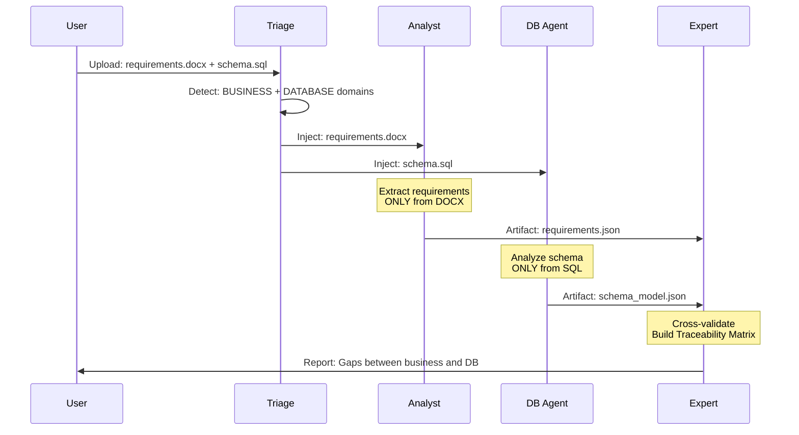
```mermaid
sequenceDiagram
    participant U as User
    participant T as Triage
    participant A as Analyst
    participant D as DB Agent
    participant E as Expert
    
    U->>T: Upload: requirements.docx + schema.sql
    T->>T: Detect: BUSINESS + DATABASE domains
    T->>A: Inject: requirements.docx
    T->>D: Inject: schema.sql
    
    Note over A: Extract requirements<br/>ONLY from DOCX
    A->>E: Artifact: requirements.json
    
    Note over D: Analyze schema<br/>ONLY from SQL
    D->>E: Artifact: schema_model.json
    
    Note over E: Cross-validate<br/>Build Traceability Matrix
    E->>U: Report: Gaps between business and DB
```

### 2. KNOWLEDGE_BASED Strategy (Expert Mode)

**Kiedy:** Brak plików, pytania koncepcyjne, best practices

**Zalety:**
- **Rapid Prototyping** - szybkie odpowiedzi bez przygotowania dokumentów
- **Expert Consultation** - dostęp do wiedzy domenowej agentów
- **Learning Tool** - edukacja w zakresie architektury systemów

**Routing inteligentny:**

Orkiestrator analizuje słowa kluczowe i kieruje do odpowiednich agentów:

| Keywords | Routed to | Example Query |
|----------|-----------|---------------|
| "sql", "database", "table", "index" | DB Agent | "Best practices for indexing timestamp columns" |
| "uml", "class", "diagram", "architecture" | UML Agent | "How to model inheritance in class diagrams?" |
| "bpmn", "process", "workflow", "gateway" | BPMN Agent | "What's the difference between XOR and OR gateways?" |
| "requirements", "user story", "acceptance criteria" | Analyst Agent | "How to write good acceptance criteria?" |

---

## 💼 Use Cases - Scenariusze Biznesowe

### UC-01: Gap Analysis - Business vs Implementation

**Problem:** Nowa funkcjonalność "Multi-currency" opisana w wymaganiach, ale czy baza danych jest gotowa?

**Aktorzy:** Product Owner, Solution Architect

**Input:**
- `requirements_v2.docx` - specyfikacja nowej funkcji
- `production_schema.sql` - obecna struktura bazy

**Workflow:**

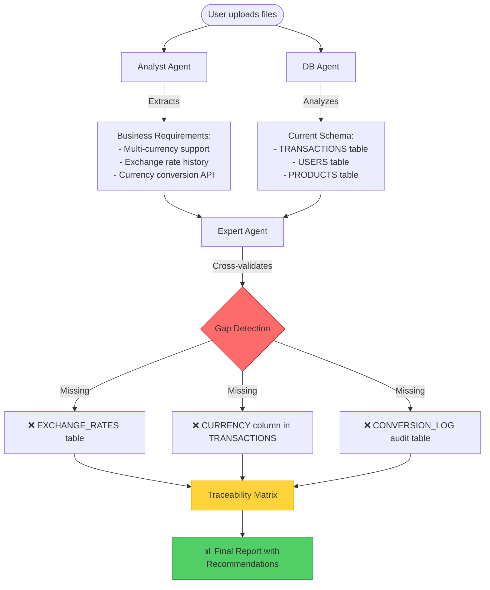
```mermaid
graph TD
    START([User uploads files]) --> ANALYST[Analyst Agent]
    
    ANALYST -->|Extracts| REQ[Business Requirements:<br/>- Multi-currency support<br/>- Exchange rate history<br/>- Currency conversion API]
    
    START --> DB[DB Agent]
    DB -->|Analyzes| SCHEMA[Current Schema:<br/>- TRANSACTIONS table<br/>- USERS table<br/>- PRODUCTS table]
    
    REQ --> EXPERT[Expert Agent]
    SCHEMA --> EXPERT
    
    EXPERT -->|Cross-validates| GAPS{Gap Detection}
    
    GAPS -->|Missing| GAP1[❌ EXCHANGE_RATES table]
    GAPS -->|Missing| GAP2[❌ CURRENCY column in TRANSACTIONS]
    GAPS -->|Missing| GAP3[❌ CONVERSION_LOG audit table]
    
    GAP1 --> MATRIX[Traceability Matrix]
    GAP2 --> MATRIX
    GAP3 --> MATRIX
    
    MATRIX --> REPORT[📊 Final Report with Recommendations]
    
    style GAPS fill:#ff6b6b,stroke:#c92a2a
    style MATRIX fill:#ffd43b,stroke:#fab005
    style REPORT fill:#51cf66,stroke:#2f9e44
```

**Output Report:**

```markdown
# Gap Analysis Report: Multi-currency Feature

## Executive Summary
⚠️ **CRITICAL GAPS DETECTED** - Database schema NOT READY for multi-currency implementation

## Traceability Matrix

| Requirement | Expected DB Structure | Current Status | Impact |
|-------------|----------------------|----------------|--------|
| REQ-MC-001: Store exchange rates | Table: EXCHANGE_RATES | ❌ MISSING | 🔴 CRITICAL |
| REQ-MC-002: Multi-currency transactions | Column: TRANSACTIONS.CURRENCY_CODE | ❌ MISSING | 🔴 CRITICAL |
| REQ-MC-003: Conversion audit trail | Table: CURRENCY_CONVERSIONS | ❌ MISSING | 🟡 MEDIUM |
| REQ-MC-004: Default currency per user | Column: USERS.DEFAULT_CURRENCY | ❌ MISSING | 🟢 LOW |

## Recommended Schema Changes

```sql
-- Priority 1: Exchange Rates Storage
CREATE TABLE EXCHANGE_RATES (
    RATE_ID INT PRIMARY KEY,
    FROM_CURRENCY CHAR(3) NOT NULL,
    TO_CURRENCY CHAR(3) NOT NULL,
    RATE DECIMAL(12,6) NOT NULL,
    VALID_FROM TIMESTAMP NOT NULL,
    VALID_TO TIMESTAMP,
    SOURCE VARCHAR(50),
    CONSTRAINT UK_EXCHANGE UNIQUE (FROM_CURRENCY, TO_CURRENCY, VALID_FROM)
);

-- Priority 2: Update Transactions Table
ALTER TABLE TRANSACTIONS 
ADD COLUMN CURRENCY_CODE CHAR(3) DEFAULT 'USD' NOT NULL,
ADD COLUMN ORIGINAL_AMOUNT DECIMAL(15,2),
ADD COLUMN EXCHANGE_RATE DECIMAL(12,6);
```

### UC-02: Legacy System Reverse Engineering

**Problem:** System działa od 10 lat, dokumentacja zaginęła, potrzebna wizualizacja architektury.

**Aktorzy:** Solution Architect, Technical Writer

**Input:**
- `legacy_export.xmi` - eksport modelu z Enterprise Architect 2015
- `legacy_database.sql` - dump struktury bazy Oracle

**Workflow:**

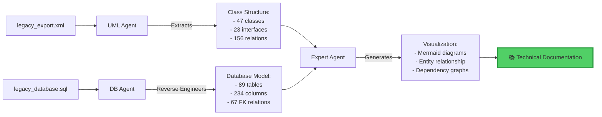
```mermaid
graph LR
    XMI[legacy_export.xmi] --> UML[UML Agent]
    SQL[legacy_database.sql] --> DB[DB Agent]
    
    UML -->|Extracts| CLASSES[Class Structure:<br/>- 47 classes<br/>- 23 interfaces<br/>- 156 relations]
    
    DB -->|Reverse Engineers| SCHEMA[Database Model:<br/>- 89 tables<br/>- 234 columns<br/>- 67 FK relations]
    
    CLASSES --> EXPERT[Expert Agent]
    SCHEMA --> EXPERT
    
    EXPERT -->|Generates| VIZ[Visualization:<br/>- Mermaid diagrams<br/>- Entity relationship<br/>- Dependency graphs]
    
    VIZ --> DOC[📚 Technical Documentation]
    
    style DOC fill:#51cf66,stroke:#2f9e44,stroke-width:3px
```

**Output - Automatically Generated Documentation:**

````markdown
# Legacy CRM System - Technical Documentation
*Auto-generated by AI Analyst Team on 2026-01-20*

## System Architecture Overview

### Core Modules

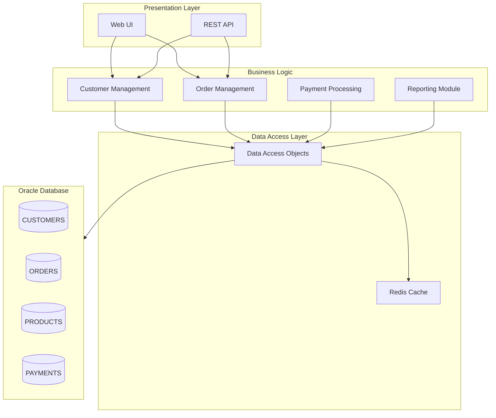
```mermaid
graph TB
    subgraph Presentation["Presentation Layer"]
        UI[Web UI]
        API[REST API]
    end
    
    subgraph Business["Business Logic"]
        CM[Customer Management]
        OM[Order Management]
        PM[Payment Processing]
        RM[Reporting Module]
    end
    
    subgraph Data["Data Access Layer"]
        DAO[Data Access Objects]
        CACHE[Redis Cache]
    end
    
    subgraph Database["Oracle Database"]
        CUST[(CUSTOMERS)]
        ORD[(ORDERS)]
        PROD[(PRODUCTS)]
        PAY[(PAYMENTS)]
    end
    
    UI --> CM
    UI --> OM
    API --> CM
    API --> OM
    
    CM --> DAO
    OM --> DAO
    PM --> DAO
    RM --> DAO
    
    DAO --> CACHE
    DAO --> Database
```

### Key Components Discovered

**Customer Management Module**
- Classes: Customer, CustomerProfile, ContactInfo, Address
- Business Logic: CRUD operations, duplicate detection, merge functionality
- Database Tables: CUSTOMERS, CUSTOMER_ADDRESSES, CUSTOMER_CONTACTS

**Order Processing Flow**
```
Order Creation → Inventory Check → Payment Authorization → 
Fulfillment → Shipping → Invoice Generation
```

**Critical Dependencies:**
- Payment module requires Customer module (tight coupling)
- Order module has cyclic dependency with Inventory ⚠️
- Reporting directly queries database (bypasses business layer) ⚠️

## Data Model

### Entity Relationship Diagram

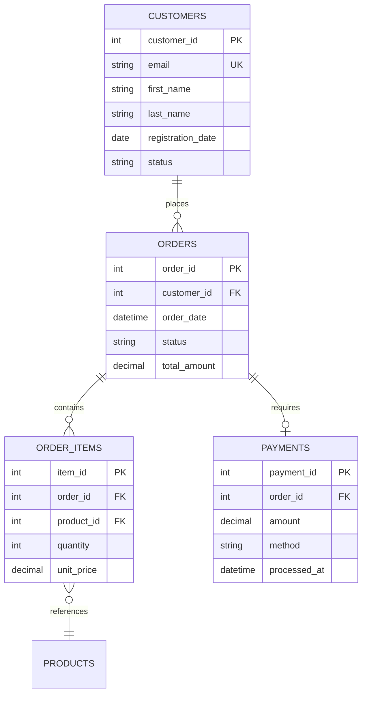
```mermaid
erDiagram
    CUSTOMERS ||--o{ ORDERS : places
    CUSTOMERS {
        int customer_id PK
        string email UK
        string first_name
        string last_name
        date registration_date
        string status
    }
    
    ORDERS ||--o{ ORDER_ITEMS : contains
    ORDERS {
        int order_id PK
        int customer_id FK
        datetime order_date
        string status
        decimal total_amount
    }
    
    ORDER_ITEMS }o--|| PRODUCTS : references
    ORDER_ITEMS {
        int item_id PK
        int order_id FK
        int product_id FK
        int quantity
        decimal unit_price
    }
    
    ORDERS ||--o| PAYMENTS : requires
    PAYMENTS {
        int payment_id PK
        int order_id FK
        decimal amount
        string method
        datetime processed_at
    }
```

### Identified Issues & Recommendations

1. **❌ Missing Indexes**
   - ORDERS.CUSTOMER_ID (frequent join)
   - PAYMENTS.ORDER_ID (performance bottleneck)
   
2. **⚠️ Data Integrity Risks**
   - No CASCADE DELETE on ORDER_ITEMS
   - PAYMENTS.AMOUNT not validated against ORDERS.TOTAL_AMOUNT
   
3. **💡 Modernization Opportunities**
   - Add CREATED_AT, UPDATED_AT audit columns
   - Implement soft delete pattern (STATUS field)
   - Denormalize customer name in ORDERS for reporting
````

**Business Value:**
- **Knowledge Preservation:** Odzyskanie utraconej wiedzy systemowej
- **Onboarding:** Przyspieszenie wdrożenia nowych developerów
- **Technical Debt:** Identyfikacja obszarów do refaktoryzacji

---

### UC-03: BPMN Process Optimization

**Problem:** Proces "Order Fulfillment" ma średni czas realizacji 7 dni, oczekiwanie: 3 dni.

**Aktorzy:** Process Owner, Business Analyst

**Input:**
- `order_fulfillment.bpmn` - obecny model procesu
- `process_metrics.xlsx` - dane historyczne (opcjonalne)

**Workflow:**

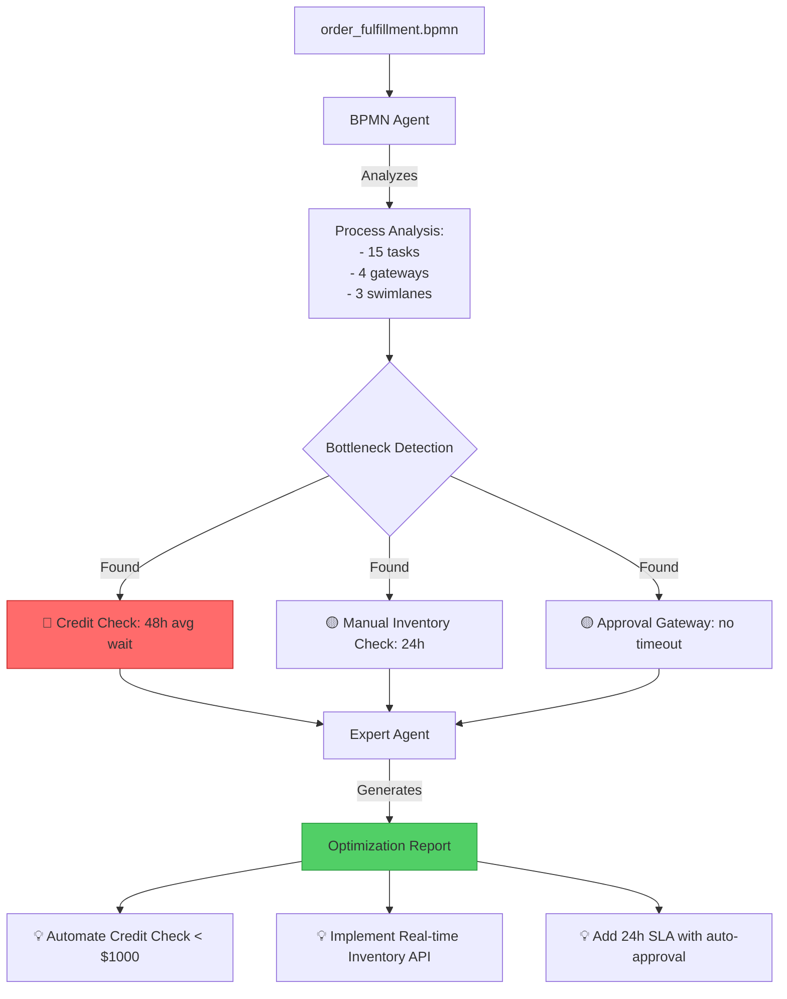
```mermaid
graph TD
    BPMN[order_fulfillment.bpmn] --> AGENT[BPMN Agent]
    
    AGENT -->|Analyzes| STEPS[Process Analysis:<br/>- 15 tasks<br/>- 4 gateways<br/>- 3 swimlanes]
    
    STEPS --> IDENTIFY{Bottleneck Detection}
    
    IDENTIFY -->|Found| B1[🔴 Credit Check: 48h avg wait]
    IDENTIFY -->|Found| B2[🟡 Manual Inventory Check: 24h]
    IDENTIFY -->|Found| B3[🟡 Approval Gateway: no timeout]
    
    B1 --> EXPERT[Expert Agent]
    B2 --> EXPERT
    B3 --> EXPERT
    
    EXPERT -->|Generates| REPORT[Optimization Report]
    
    REPORT --> REC1[💡 Automate Credit Check < $1000]
    REPORT --> REC2[💡 Implement Real-time Inventory API]
    REPORT --> REC3[💡 Add 24h SLA with auto-approval]
    
    style B1 fill:#ff6b6b,stroke:#c92a2a
    style REPORT fill:#51cf66,stroke:#2f9e44
```

**Output Report:**

```markdown
# Process Optimization Report: Order Fulfillment

## Current State Analysis

**Process Metrics:**
- Total Steps: 15
- Decision Points: 4
- Participants: 3 (Sales, Warehouse, Finance)
- Average Cycle Time: 7.2 days
- Bottleneck Impact: 68% of delays caused by manual checks

## Critical Path Analysis

```
Order Received (0h) → 
  Credit Check (48h ⚠️) → 
    Inventory Verification (24h ⚠️) → 
      Manager Approval (12h) → 
        Picking & Packing (4h) → 
          Shipping (72h) → 
            Invoice (2h)
```

## Identified Bottlenecks

### 🔴 CRITICAL: Credit Check (48h average wait)
**Current Process:**
- All orders manually reviewed by Finance
- Queue processing once per day
- No automation for low-risk customers

**Impact:** 33% of total cycle time

**Recommendation:**
```
IF order_value < $1000 AND customer_history == "good" THEN
  auto_approve
ELSE
  manual_review WITH 24h SLA
END
```

**Expected Improvement:** -30h cycle time

### 🟡 MEDIUM: Inventory Check (24h)
**Current Process:**
- Warehouse manually verifies stock
- No real-time inventory system
- Phone/email communication with Sales

**Recommendation:**
- Implement inventory API integration
- Auto-reserve stock upon order creation
- Release reservation if payment fails

**Expected Improvement:** -22h cycle time

## Optimized Process Design

[Generated BPMN with improvements would be included here]

## ROI Projection

| Metric | Current | Optimized | Improvement |
|--------|---------|-----------|-------------|
| Avg Cycle Time | 7.2 days | 3.1 days | **-57%** |
| Manual Tasks | 8 | 3 | **-62%** |
| Customer Satisfaction | 72% | Est. 88% | **+16pp** |
| Process Cost | $45/order | $28/order | **-38%** |
```

**Business Value:**
- **Efficiency Gain:** Redukcja czasu realizacji o 57%
- **Cost Reduction:** Oszczędność $17 na zamówienie
- **Customer Experience:** Wzrost satysfakcji klientów

---

### UC-04: API Documentation Generation

**Problem:** Microservice ma 47 endpointów, brak aktualnej dokumentacji Swagger.

**Aktorzy:** Backend Developer, API Product Manager

**Input:**
- `api_routes.py` / `controllers/` - kod źródłowy endpointów
- `models/` - definicje modeli danych

**Future Capability (API Agent - Roadmap):**

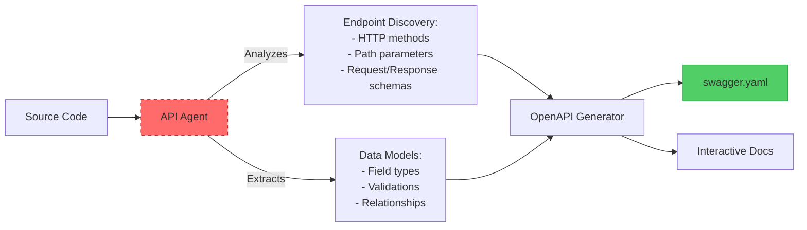
```mermaid
graph LR
    CODE[Source Code] --> API_AGENT[API Agent]
    
    API_AGENT -->|Analyzes| ENDPOINTS[Endpoint Discovery:<br/>- HTTP methods<br/>- Path parameters<br/>- Request/Response schemas]
    
    API_AGENT -->|Extracts| MODELS[Data Models:<br/>- Field types<br/>- Validations<br/>- Relationships]
    
    ENDPOINTS --> GENERATOR[OpenAPI Generator]
    MODELS --> GENERATOR
    
    GENERATOR --> SWAGGER[swagger.yaml]
    GENERATOR --> DOCS[Interactive Docs]
    
    style API_AGENT fill:#ff6b6b,stroke:#c92a2a,stroke-dasharray: 5 5
    style SWAGGER fill:#51cf66,stroke:#2f9e44
```

---

### UC-05: Confluence Wiki Auto-Update

**Problem:** Dokumentacja w Confluence nieaktualna, developerzy nie mają czasu na update.

**Aktorzy:** Technical Writer, DevOps Team

**Future Capability (Wiki Agent - Roadmap):**

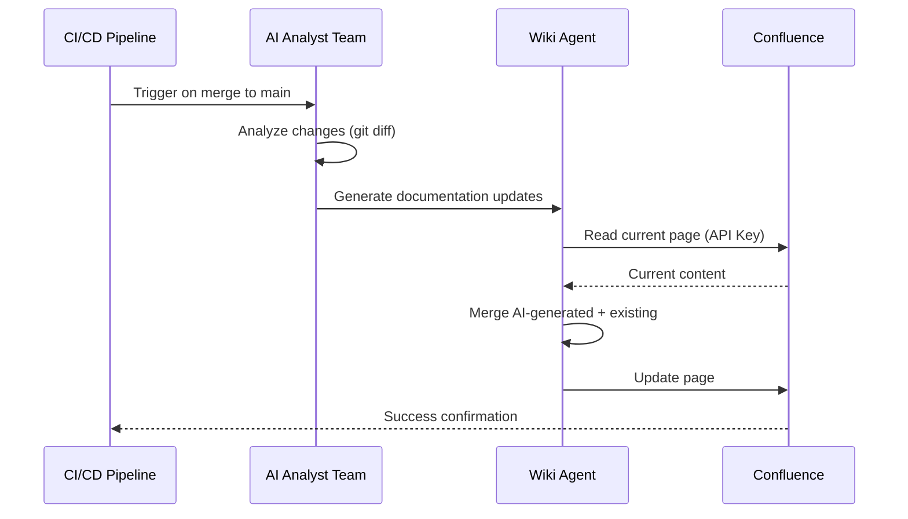
```mermaid
sequenceDiagram
    participant CI as CI/CD Pipeline
    participant AA as AI Analyst Team
    participant WA as Wiki Agent
    participant CF as Confluence
    
    CI->>AA: Trigger on merge to main
    AA->>AA: Analyze changes (git diff)
    AA->>WA: Generate documentation updates
    WA->>CF: Read current page (API Key)
    CF-->>WA: Current content
    WA->>WA: Merge AI-generated + existing
    WA->>CF: Update page
    CF-->>CI: Success confirmation
```

**Benefits:**
- **Always Up-to-Date:** Dokumentacja aktualizowana przy każdym merge
- **Zero Manual Effort:** Automatyzacja 100% procesu
- **Audit Trail:** Każda zmiana z linkiem do commit

---

### UC-06: Database Schema Evolution Tracking

**Problem:** Baza przeszła 23 migracje, trudno zrozumieć co się zmieniło od wersji 1.0 do 2.3.

**Aktorzy:** Database Administrator, Compliance Officer

**Input:**
- `schema_v1.0.sql` - początkowa wersja
- `schema_v2.3.sql` - obecna wersja

**Workflow:**

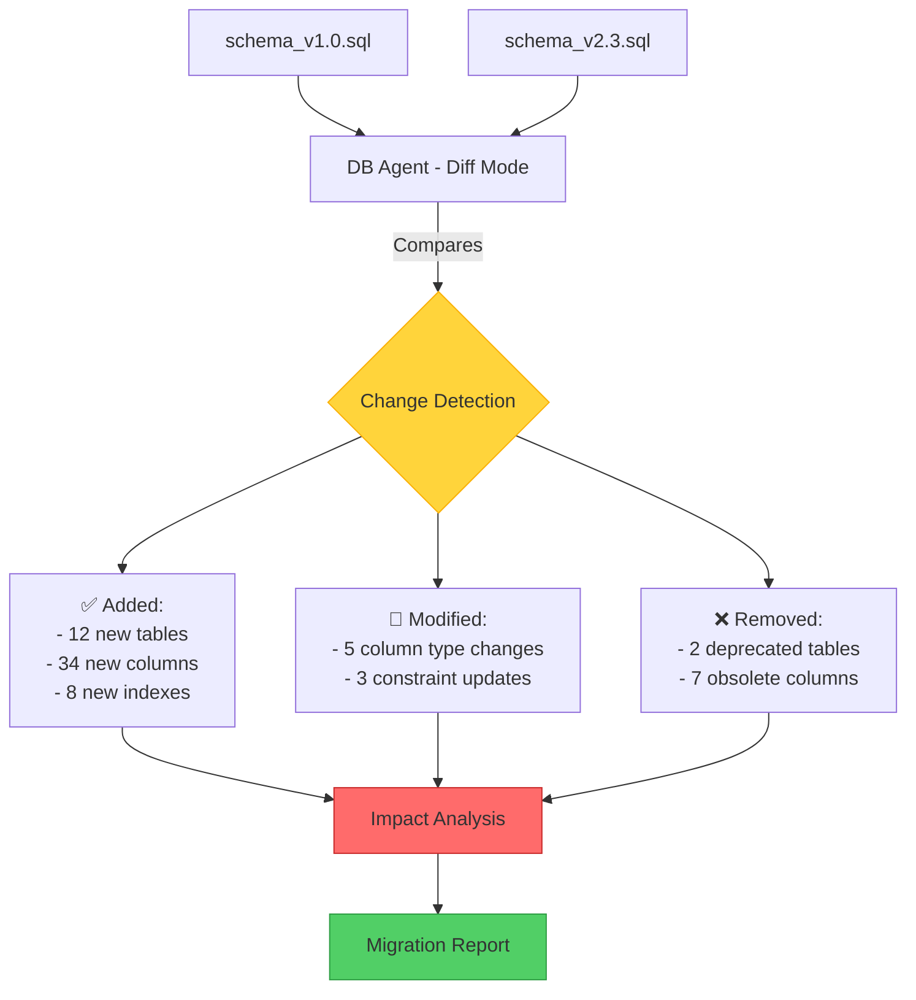
```mermaid
graph TD
    V1[schema_v1.0.sql] --> DIFF[DB Agent - Diff Mode]
    V2[schema_v2.3.sql] --> DIFF
    
    DIFF -->|Compares| CHANGES{Change Detection}
    
    CHANGES --> ADD[✅ Added:<br/>- 12 new tables<br/>- 34 new columns<br/>- 8 new indexes]
    CHANGES --> MOD[🔄 Modified:<br/>- 5 column type changes<br/>- 3 constraint updates]
    CHANGES --> DEL[❌ Removed:<br/>- 2 deprecated tables<br/>- 7 obsolete columns]
    
    ADD --> IMPACT[Impact Analysis]
    MOD --> IMPACT
    DEL --> IMPACT
    
    IMPACT --> REPORT[Migration Report]
    
    style CHANGES fill:#ffd43b,stroke:#fab005
    style IMPACT fill:#ff6b6b,stroke:#c92a2a
    style REPORT fill:#51cf66,stroke:#2f9e44
```

**Output:**

```markdown
# Schema Evolution Report: v1.0 → v2.3

## Summary of Changes

**Total Migrations:** 23  
**Time Period:** 2023-01-15 to 2026-01-20  
**Impact Level:** 🟡 MEDIUM (backward compatibility maintained)

## Detailed Change Log

### ✅ New Tables (12)

| Table Name | Purpose | Added In | Impact |
|------------|---------|----------|--------|
| EXCHANGE_RATES | Multi-currency support | v2.0 | HIGH - New feature |
| AUDIT_LOGS | Compliance tracking | v2.1 | MEDIUM - Security |
| USER_SESSIONS | Session management | v1.5 | LOW - Infrastructure |

### 🔄 Schema Changes (5)

| Table | Column | Change | Migration | Breaking? |
|-------|--------|--------|-----------|-----------|
| USERS | email | VARCHAR(100) → VARCHAR(255) | v1.8 | ❌ No |
| ORDERS | total | DECIMAL(10,2) → DECIMAL(15,2) | v2.0 | ❌ No |
| PRODUCTS | status | CHAR(1) → VARCHAR(20) | v2.2 | ⚠️ Potentially |

### ❌ Deprecated Elements (2)

| Element | Type | Removed In | Replacement |
|---------|------|------------|-------------|
| OLD_TRANSACTIONS | Table | v2.0 | Merged into TRANSACTIONS |
| temp_calculation | Column | v1.9 | Calculated field in app |

## Compliance Check

✅ **GDPR Compliance:** All PII fields properly indexed for deletion  
✅ **Audit Trail:** All financial tables have CREATED_AT, UPDATED_AT  
⚠️ **Data Retention:** AUDIT_LOGS lacks automatic purging (Recommendation: add TTL)

## Rollback Safety

**v2.3 → v2.2:** ✅ Safe (additive changes only)  
**v2.2 → v2.1:** ⚠️ Risky (PRODUCTS.status type change)  
**v2.1 → v2.0:** ❌ Not Supported (data migration required)
```

---

## 💎 Innowacje i WOW Factors

### 1. Traceability Matrix - Innowacja Kluczowa

**Czym jest:** Automatyczna macierz powiązań między różnymi warstwami systemu.

**Architektura implementacji:**

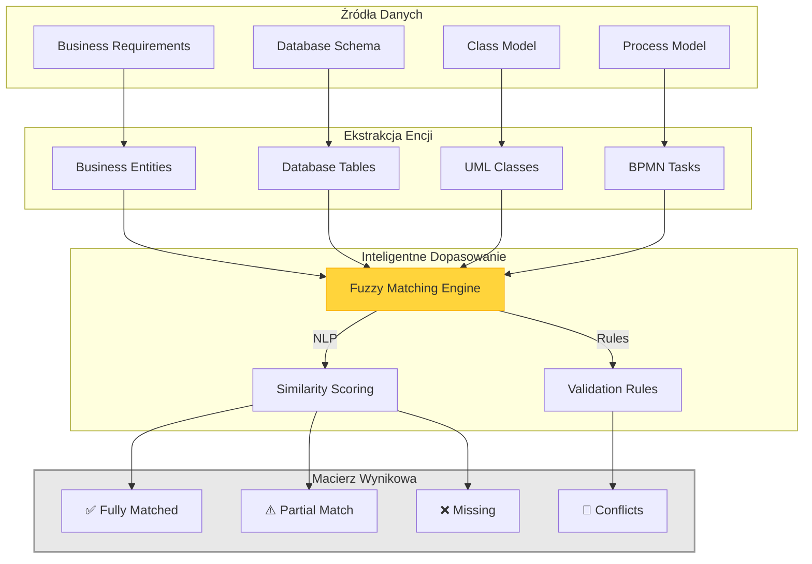
```mermaid
graph TB
    subgraph Sources["Źródła Danych"]
        BIZ[Business Requirements]
        DB[Database Schema]
        UML[Class Model]
        BPMN[Process Model]
    end
    
    subgraph Extraction["Ekstrakcja Encji"]
        BIZ --> BE[Business Entities]
        DB --> DT[Database Tables]
        UML --> CL[UML Classes]
        BPMN --> TA[BPMN Tasks]
    end
    
    subgraph Matching["Inteligentne Dopasowanie"]
        BE --> MATCHER[Fuzzy Matching Engine]
        DT --> MATCHER
        CL --> MATCHER
        TA --> MATCHER
        
        MATCHER -->|NLP| SIM[Similarity Scoring]
        MATCHER -->|Rules| VAL[Validation Rules]
    end
    
    subgraph Matrix["Macierz Wynikowa"]
        SIM --> FULL[✅ Fully Matched]
        SIM --> PARTIAL[⚠️ Partial Match]
        SIM --> MISSING[❌ Missing]
        
        VAL --> CONFLICTS[🔴 Conflicts]
    end
    
    style MATCHER fill:#ffd43b,stroke:#fab005
    style Matrix fill:#e8e8e8,stroke:#999,stroke-width:2px
```

**Przykład algorytmu dopasowania:**

```python
class TraceabilityMatcher:
    """
    Inteligentne dopasowanie encji między domenami
    wykorzystując NLP i regułowe heurystyki
    """
    
    def match_entities(
        self,
        business_entities: List[str],
        db_tables: List[str],
        uml_classes: List[str]
    ) -> TraceabilityMatrix:
        
        matrix = TraceabilityMatrix()
        
        for biz_entity in business_entities:
            # Faza 1: Exact match
            exact_db = self._find_exact_match(biz_entity, db_tables)
            exact_uml = self._find_exact_match(biz_entity, uml_classes)
            
            # Faza 2: Fuzzy match (similarity > 0.8)
            if not exact_db:
                exact_db = self._find_fuzzy_match(
                    biz_entity, db_tables, threshold=0.8
                )
            
            # Faza 3: Semantic match (using embeddings)
            if not exact_db:
                exact_db = self._find_semantic_match(
                    biz_entity, db_tables
                )
            
            # Budowa wpisu macierzy
            entry = MatrixEntry(
                business_entity=biz_entity,
                db_table=exact_db,
                uml_class=exact_uml,
                confidence=self._calculate_confidence(exact_db, exact_uml),
                status=self._determine_status(exact_db, exact_uml)
            )
            
            matrix.add_entry(entry)
        
        return matrix
```

### 2. Cost Attribution - Precyzyjny Audyt Finansowy

**Innowacja:** System śledzi koszty w czasie rzeczywistym na poziomie pojedynczego wywołania agenta.

**Architektura metryki:**

```typescript
interface CostMetrics {
  session_id: string;
  total_cost_usd: number;
  breakdown: {
    agent_id: string;
    model: 'gpt-4-turbo' | 'claude-3-opus' | 'gemini-pro';
    tokens_input: number;
    tokens_output: number;
    cost_input: number;
    cost_output: number;
    latency_ms: number;
    timestamp: number;
  }[];
  cost_per_file: {
    filename: string;
    allocated_cost: number;
  }[];
}
```

**Dashboard wizualizacji:**

```markdown
## Session Cost Report

**Total Cost:** $0.47 USD  
**Total Tokens:** 28,450  
**Total Time:** 12.3 seconds  

### Cost Breakdown by Agent

| Agent | Model | Tokens In | Tokens Out | Cost | % of Total |
|-------|-------|-----------|------------|------|------------|
| Analyst | Claude 3 Opus | 5,230 | 1,890 | $0.18 | 38% |
| DB Agent | GPT-4 Turbo | 8,120 | 2,340 | $0.15 | 32% |
| UML Agent | Gemini Pro | 3,450 | 980 | $0.06 | 13% |
| Expert | GPT-4 Turbo | 6,890 | 2,550 | $0.08 | 17% |

```

### 3. Hot-Reload Configuration

**Problem tradycyjny:** Zmiana zachowania agenta wymaga redeploy całej aplikacji.

**Rozwiązanie AI Analyst Team:**

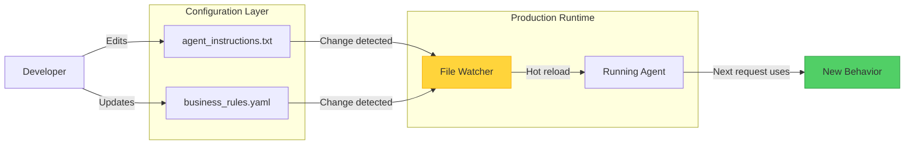
```mermaid
graph LR
    subgraph Runtime["Production Runtime"]
        AGENT[Running Agent]
        WATCHER[File Watcher]
    end
    
    subgraph Config["Configuration Layer"]
        TXT[agent_instructions.txt]
        RULES[business_rules.yaml]
    end
    
    DEV[Developer] -->|Edits| TXT
    DEV -->|Updates| RULES
    
    TXT -->|Change detected| WATCHER
    RULES -->|Change detected| WATCHER
    
    WATCHER -->|Hot reload| AGENT
    
    AGENT -->|Next request uses| NEW_BEHAVIOR[New Behavior]
    
    style WATCHER fill:#ffd43b,stroke:#fab005
    style NEW_BEHAVIOR fill:#51cf66,stroke:#2f9e44
```

**Przykład:** Zmiana rygoru DB Agenta

```diff
# db_agent_instructions.txt

- You are a conservative database analyst.
+ You are an aggressive performance optimizer.

- Focus on data integrity and normalization.
+ Prioritize query performance, even if it means denormalization.

- Recommend indexes cautiously.
+ Suggest indexes aggressively for all foreign keys and frequent queries.
```

**Efekt:** Następne wywołanie DB Agenta natychmiast używa nowych instrukcji - zero downtime!


### 5. Automatic Diagram Rendering

**Magia:** System rozpoznaje kod diagramów i automatycznie renderuje do podglądu.

**Supported Formats:**
- **Mermaid** - diagramy flowchart, sequence, class, ER
- **PlantUML** - diagramy UML, architektoniczne
- **GraphViz DOT** - grafy zależności

**Pipeline:**

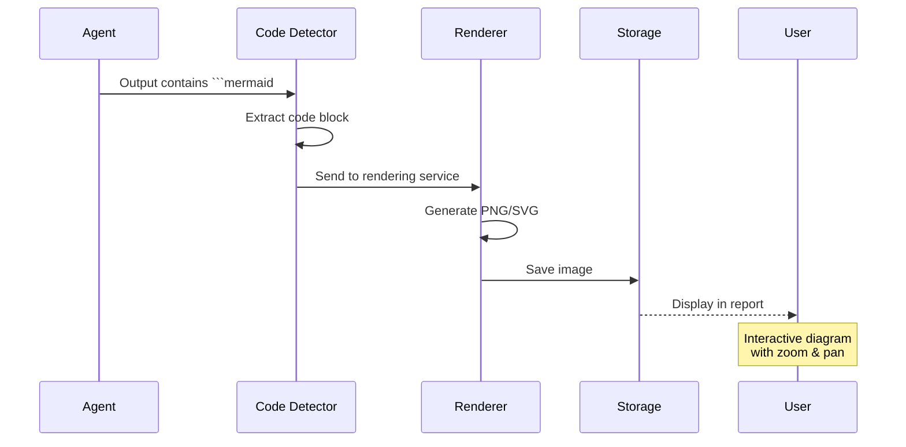
```mermaid
sequenceDiagram
    participant Agent
    participant Detector as Code Detector
    participant Renderer
    participant Storage
    participant User
    
    Agent->>Detector: Output contains ```mermaid
    Detector->>Detector: Extract code block
    Detector->>Renderer: Send to rendering service
    Renderer->>Renderer: Generate PNG/SVG
    Renderer->>Storage: Save image
    Storage-->>User: Display in report
    
    Note over User: Interactive diagram<br/>with zoom & pan
```

---

## 📊 Monitoring i Audyt

### Real-time Metrics Dashboard

System ekspozuje metryki dla każdej sesji:

```markdown
## Live Session Metrics

**Session ID:** sess_20260120_1843  
**Status:** 🟢 In Progress  
**Elapsed Time:** 00:08:32  

### Agent Activity

| Agent | Status | Progress | Tokens | Cost |
|-------|--------|----------|--------|------|
| Orchestrator | ✅ Complete | 100% | 450 | $0.01 |
| Analyst | ✅ Complete | 100% | 5,230 | $0.18 |
| DB Agent | 🔄 Running | 67% | 6,890 | $0.12 |
| Expert | ⏳ Waiting | 0% | 0 | $0.00 |

### Discuss Room Activity

**Total Entries:** 47  
**Internal Thoughts:** 28  
**Public Messages:** 12  
**Artifacts:** 7  

**Latest Activity:**
```
[08:31:45] DB Agent: Found 23 tables in schema
[08:31:52] DB Agent: Analyzing foreign key relationships...
[08:32:15] DB Agent: 🎯 Published artifact: schema_model.json
```
```

### Audit Trail

Każda akcja systemu jest logowana dla compliance:

```json
{
  "audit_log": [
    {
      "timestamp": "2026-01-20T18:43:12Z",
      "event": "file_uploaded",
      "user_id": "user_12345",
      "file": "requirements.docx",
      "size_bytes": 45231,
      "hash_sha256": "a3f5e9..."
    },
    {
      "timestamp": "2026-01-20T18:43:15Z",
      "event": "agent_activated",
      "agent": "analyst_agent",
      "reason": "docx_file_detected",
      "orchestrator_decision": "file_based_strategy"
    },
    {
      "timestamp": "2026-01-20T18:43:45Z",
      "event": "llm_query",
      "agent": "analyst_agent",
      "model": "claude-3-opus",
      "tokens_input": 5230,
      "tokens_output": 1890,
      "cost_usd": 0.18,
      "latency_ms": 2340
    }
  ]
}
```

---

## 🗺️ Roadmapa Rozwoju

### Advanced Integrations

#### API Agent
**Cel:** Automatyczna analiza i dokumentacja REST APIs

**Capabilities:**
- Auto-detection of endpoints from code
- Request/response schema inference
- Authentication flow documentation
- Example request generation
- Swagger UI auto-deployment

###  Enterprise Architect Integration

#### EA Connector (MCP Protocol)
**Cel:** Dwukierunkowa integracja z Enterprise Architect

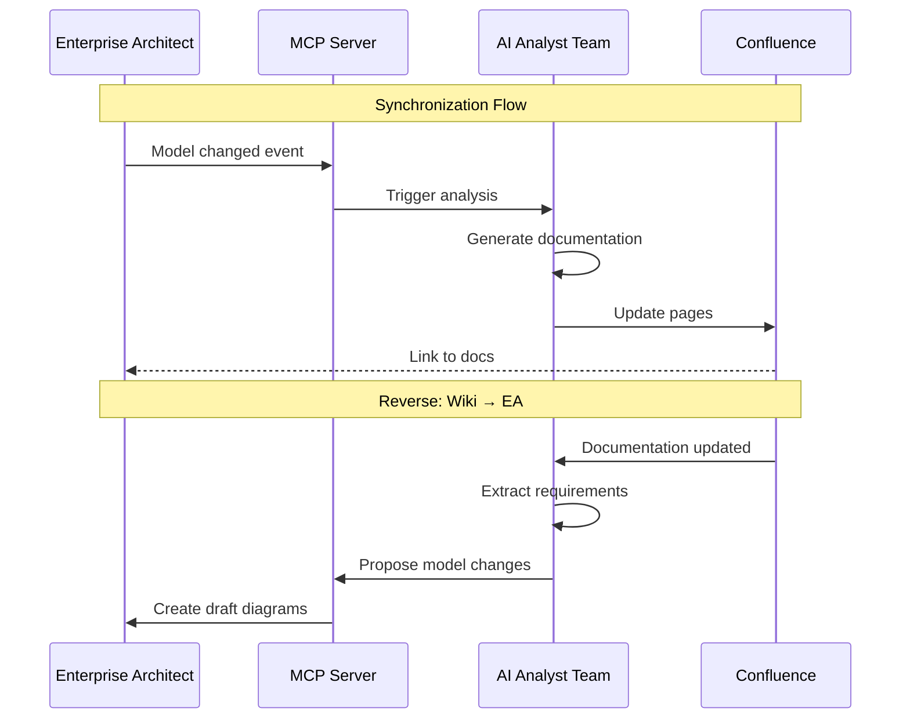
```mermaid
sequenceDiagram
    participant EA as Enterprise Architect
    participant MCP as MCP Server
    participant AI as AI Analyst Team
    participant WIKI as Confluence
    
    Note over EA,WIKI: Synchronization Flow
    
    EA->>MCP: Model changed event
    MCP->>AI: Trigger analysis
    AI->>AI: Generate documentation
    AI->>WIKI: Update pages
    WIKI-->>EA: Link to docs
    
    Note over EA,WIKI: Reverse: Wiki → EA
    
    WIKI->>AI: Documentation updated
    AI->>AI: Extract requirements
    AI->>MCP: Propose model changes
    MCP->>EA: Create draft diagrams
```

**Features:**
- Read EA repositories (.eap files)
- Extract diagrams, classes, packages
- Bi-directional sync with Wiki
- Change impact analysis
- Auto-generate documentation from models

### Live Database Integration

#### DB Live Agent
**Cel:** Bezpieczne połączenie do produkcyjnych baz danych

```mermaid
graph TB
    subgraph Security["Security Layer"]
        AUTH[OAuth 2.0]
        RBAC[Role-Based Access]
        AUDIT[Audit Logging]
    end
    
    subgraph DBLive["DB Live Agent"]
        READONLY[Read-Only Mode]
        QUERY[Query Builder]
        EXPLAIN[EXPLAIN Analyzer]
    end
    
    subgraph Databases["Target Databases"]
        PG[(PostgreSQL)]
        MYSQL[(MySQL)]
        MSSQL[(SQL Server)]
        ORACLE[(Oracle)]
    end
    
    AUTH --> DBLive
    RBAC --> DBLive
    
    DBLive --> PG
    DBLive --> MYSQL
    DBLive --> MSSQL
    DBLive --> ORACLE
    
    DBLive --> AUDIT
    
    style Security fill:#ff6b6b,stroke:#c92a2a
    style DBLive fill:#ffd43b,stroke:#fab005
```

**Safety Features:**
- **Read-Only Connections:** Tylko SELECT queries
- **Query Timeouts:** Max 30s execution time
- **Row Limits:** Max 1000 rows per query
- **IP Whitelisting:** Restricted access
- **Audit Trail:** Full query logging

### Collaboration Features

#### Confluence Wiki Agent
**Cel:** Auto-update dokumentacji w Confluence

**Architecture:**

```mermaid
graph TD
    subgraph Trigger["Trigger Events"]
        GIT[Git Commit]
        SCHEDULE[Scheduled Scan]
        MANUAL[Manual Request]
    end
    
    subgraph WikiAgent["Wiki Agent"]
        READ[Read Current Pages]
        ANALYZE[Analyze Changes]
        MERGE[Smart Merge]
        UPDATE[Update Pages]
    end
    
    subgraph Confluence["Confluence Cloud"]
        SPACE[Project Space]
        PAGES[Documentation Pages]
        ATTACHMENTS[Diagrams & Files]
    end
    
    GIT --> WikiAgent
    SCHEDULE --> WikiAgent
    MANUAL --> WikiAgent
    
    WikiAgent --> READ
    READ --> SPACE
    
    ANALYZE --> MERGE
    MERGE --> UPDATE
    
    UPDATE --> PAGES
    UPDATE --> ATTACHMENTS
    
    style WikiAgent fill:#51cf66,stroke:#2f9e44
```
