# 🤖 AI Analyst Team
## Inteligentny Ekosystem Wieloagentowy 
**Demo:** [AI Analyst Team](https://analystaiteam.netlify.app/)  
**Wersja:** 1.0.0 Enterprise Edition  
**Status:** Production-Ready PoC

**LinkedIn:** [Karolina Stasiarczyk- znajdź mnie](https://www.linkedin.com/in/karolina-stasiarczyk/)    
**Dokumentacja:** [docs.ai-analyst.com](https://docs.ai-analyst.com)
---

## 📊 Slajd 1: Problem Biznesowy i Rozwiązanie

### Problem Biznesowy

Tradycyjne podejście do dokumentacji systemowej boryka się z fundamentalnymi wyzwaniami:

- **Fragmentacja wiedzy** - informacje rozproszone w różnych systemach (EA, Confluence, SharePoint, SQL)
- **Brak synchronizacji** - dokumentacja biznesowa nie jest spójna z implementacją techniczną
- **Wysokie koszty** - drogie licencje narzędzi CASE i dedykowany czas analityków
- **Szybka deprecjacja** - dokumentacja staje się nieaktualna zanim zostanie ukończona

### Rozwiązanie

**AI Analyst Team** to wieloagentowy ekosystem zaprojektowany do automatyzacji procesów analizy systemowej i biznesowej. System nie jest prostym chatbotem, lecz inteligentną "sztafetą" wyspecjalizowanych agentów AI, którzy wspólnie rozwiązują złożone problemy inżynierskie – od weryfikacji wymagań biznesowych, przez audyt struktur bazodanowych (SQL), aż po inżynierię wsteczną modeli UML/BPMN.

System implementuje **Multi-Agent Relay Pattern** - inteligentną sztafetę wyspecjalizowanych agentów, gdzie każdy buduje na dedykowanych plikach lub/i na wynikach poprzedniego, a centralny Orkiestrator zapewnia spójność i jakość.

### 💥 Wyzwania Tradycyjnego Podejścia

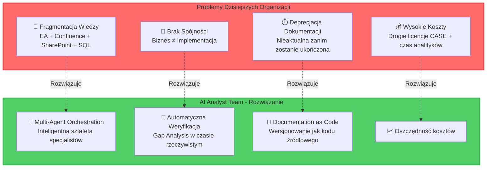

## 🏗️ Slajd 2: Architektura Systemu - "Jak to działa?"

### Orkiestracja Inteligentnych Agentów

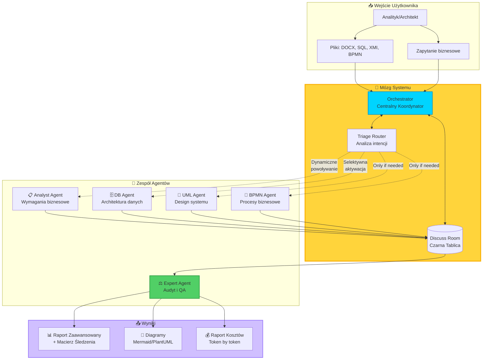

### 🔑 Kluczowe Innowacje

- **Blackboard Architecture** - Agenci współdzielą wiedzę przez wspólną przestrzeń
- **Selective Activation** - Tylko potrzebni agenci są aktywowani (oszczędność tokenów)
- **Expert Validation** - Finalny audyt wykrywa halucynacje i niespójności

---

## 💎 Slajd 3: WOW Factors - Unikalne Funkcjonalności

### 1️⃣ Traceability Matrix - Automatyczne Wykrywanie Luk

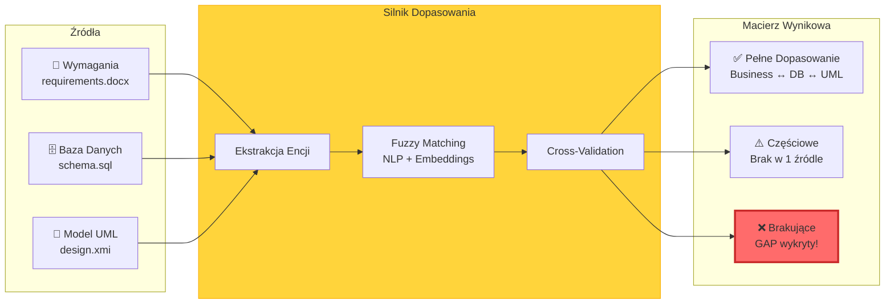

**Przykład wykrytego GAP:**

| Wymaganie | Oczekiwana Tabela | Status w DB | Impact |
|-----------|-------------------|-------------|--------|
| REQ-MC-001: Wielowalutowość | EXCHANGE_RATES | ❌ BRAK | 🔴 **CRITICAL** |
| REQ-MC-002: Historia kursów | CURRENCY_HISTORY | ❌ BRAK | 🟡 MEDIUM |

### 2️⃣ Precyzyjny Audyt Kosztów - Token by Token

```markdown
💰 Session Cost Report

Total Cost: $0.47 USD
Total Tokens: 28,450
Time: 12.3s

Agent Breakdown:
├─ Analyst Agent (Claude 3): $0.18 (38%)
├─ DB Agent (GPT-4): $0.15 (32%)
├─ UML Agent (Gemini): $0.06 (13%)
└─ Expert Agent (GPT-4): $0.08 (17%)

```

### 3️⃣ Hot-Reload Configuration

```diff
# Zmiana zachowania agenta BEZ restartu!

# db_agent_instructions.txt
- You are a conservative analyst
+ You are an aggressive optimizer

Następne zapytanie: ✅ Nowe instrukcje aktywne!
```

---

## 🎯 Slajd 4: Use Cases - Realne Scenariusze Biznesowe

### UC-01: Gap Analysis - "Czy baza jest gotowa na nową funkcję?"

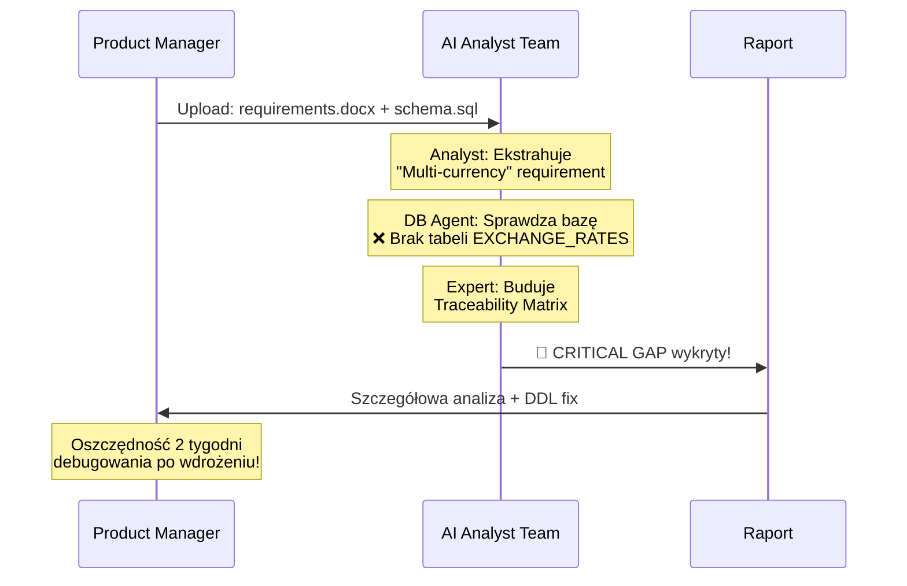

**Wartość:** Wykrycie problemów **przed** startem developmentu

---

### UC-02: Legacy Reverse Engineering - "Co robi ten 10-letni system?"

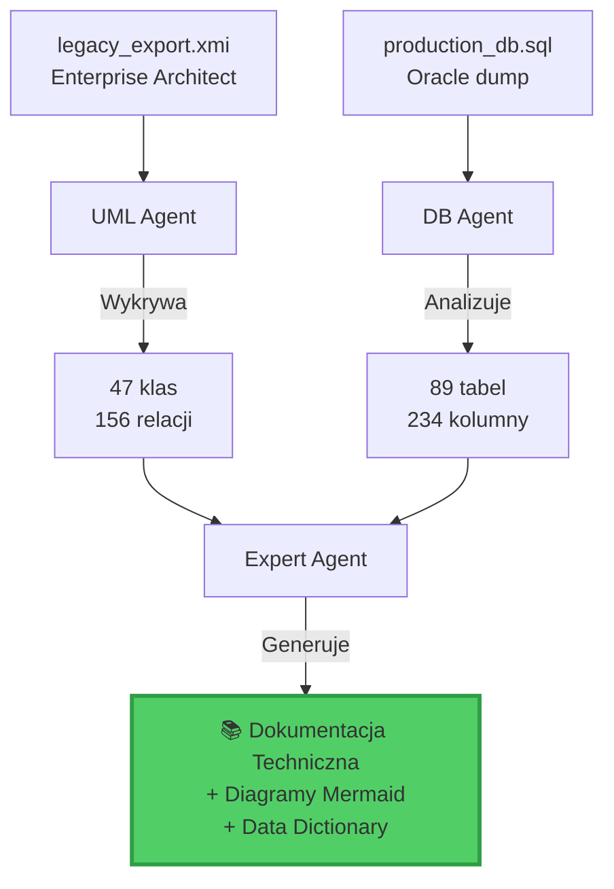

**Wartość:** Odzyskanie utraconej wiedzy, onboarding nowych dev ↓75% czasu

---

### UC-03: BPMN Optimization - "Dlaczego proces trwa 7 dni zamiast 3?"

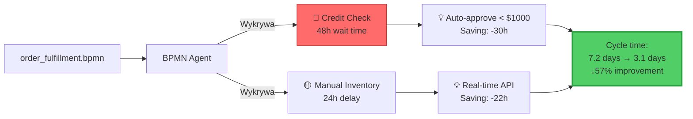

**Wartość:** Konkretne rekomendacje optymalizacyjne + ROI calculation

---

## 🛠️ Slajd 5: Stack Technologiczny i Proces Tworzenia

### Architektura Aplikacji

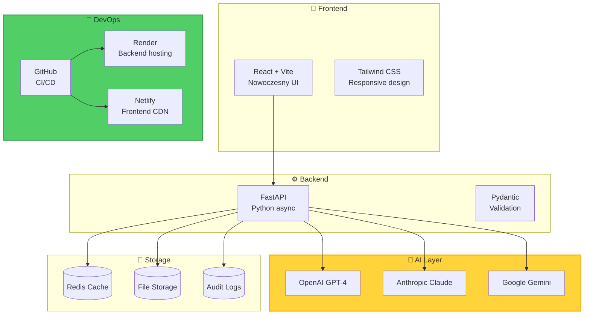

### 🔄 Ewolucja Projektu - AI Building AI

**Projekt nie powstał jako gotowa koncepcja - ewoluował iteracyjnie!**

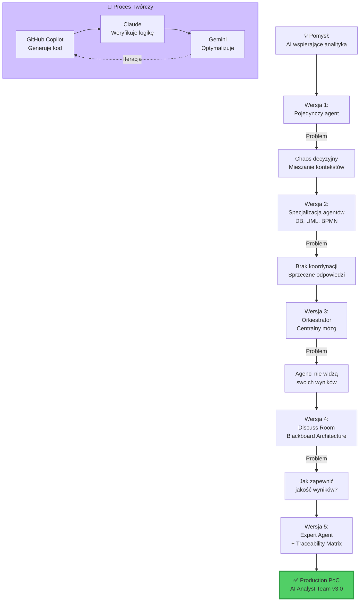

**Kluczowe lekcje:**
1. **Iteracyjność** - Każdy problem prowadził do nowej innowacji
2. **AI-Assisted Development** - Modele współpracowały: jeden pisał, drugi weryfikował
3. **User Feedback Loop** - Architektura dostosowywana do realnych potrzeb

---

## 🗺️ Slajd 6: Roadmapa - Co dalej?

### Q1-Q4 2026: Planowane Rozszerzenia

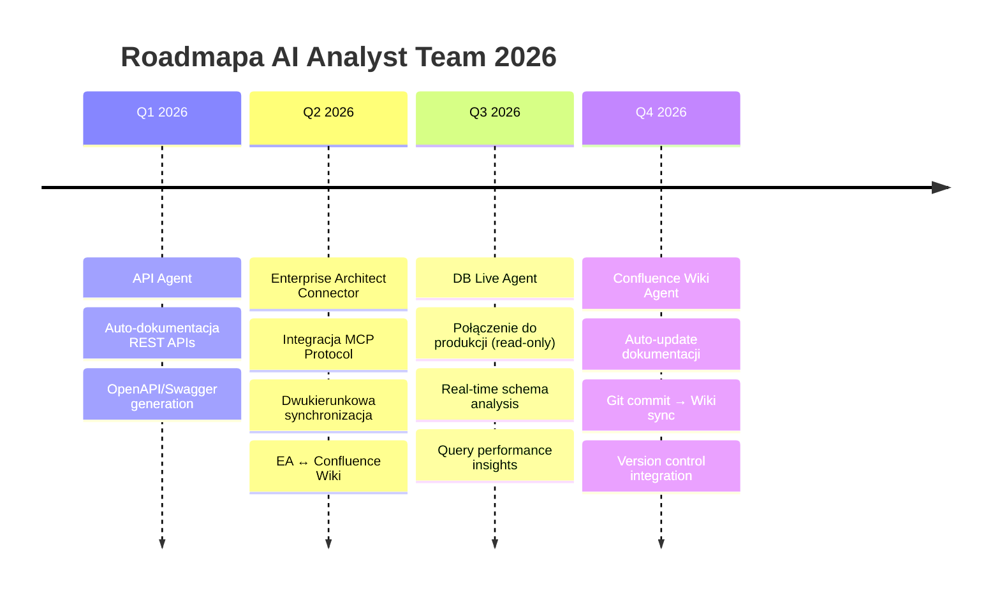

### Wizja Przyszłości: Pełny Cykl DevOps

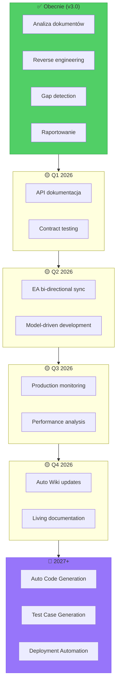
---

## 📈 Slajd 7: Podsumowanie i Wartość Biznesowa

### 🎯 Dlaczego AI Analyst Team?

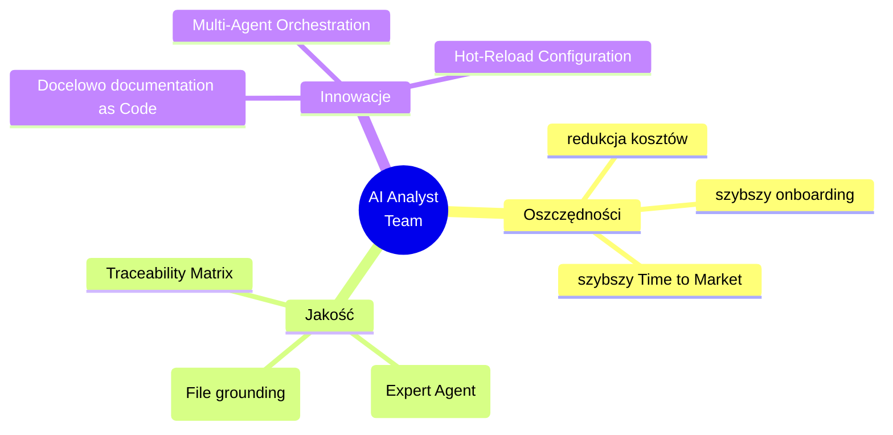

### 💡 Kluczowe Przesłanie

```
┌─────────────────────────────────────────────────────┐
│                                                     │
│  AI Analyst Team to NIE ZAMIENNIK analityka,       │
│  lecz SUPER-MÓZG który:                            │
│                                                     │
│  ✅ Przetwarza dokumenty  szybciej                  │
│  ✅ Nigdy nie zapomina szczegółów                  │
│  ✅ Pracuje 24/7 bez wypalenia                     │
│  ✅ Kosztuje znaczną część pracy człowieka          │
│                                                     │
│  = Analityk może skupić się na strategii,          │
│    system zajmuje się mechaniką! 🚀                │
│                                                     │
└─────────────────────────────────────────────────────┘
```

### 🎬 Call to Action

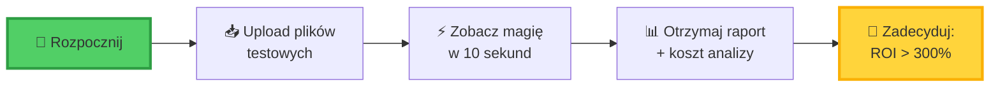

**Demo:** [AI Analyst Team](https://analystaiteam.netlify.app/)  
**LinkedIn:** [Karolina Stasiarczyk- znajdź mnie](https://www.linkedin.com/in/karolina-stasiarczyk/)    
**Dokumentacja:** [docs.ai-analyst.com](https://docs.ai-analyst.com)

---

### 🙏 Podziękowania

**Projekt powstał dzięki współpracy:**
- 🤖 **GitHub Copilot** - Generowanie kodu
- 🧠 **Claude 3** - Architektura i weryfikacja, generowanie kodu
- 💡 **Gemini** - Optymalizacje i refactoring, generowanie kodu, prompty dla Copilota i spółki

**"AI building AI for humans"**  - przy moim czujnym nadzorze 🌟

---

## 📎 Dodatek: Quick Reference

### Supported File Types

| Typ | Format | Agent | Use Case |
|-----|--------|-------|----------|
| 📄 Dokumenty | DOCX, PDF, MD | Analyst | Wymagania, specyfikacje |
| 🗄️ Bazy danych | SQL, DDL, DML | DB Agent | Schema analysis |
| 🎨 UML | XML, XMI, EAP | UML Agent | Diagramy klas |
| 🔄 Procesy | BPMN | BPMN Agent | Workflow analysis |


---

**© 2026 AI Analyst Team** | Documentation as Code Revolution 🚀
